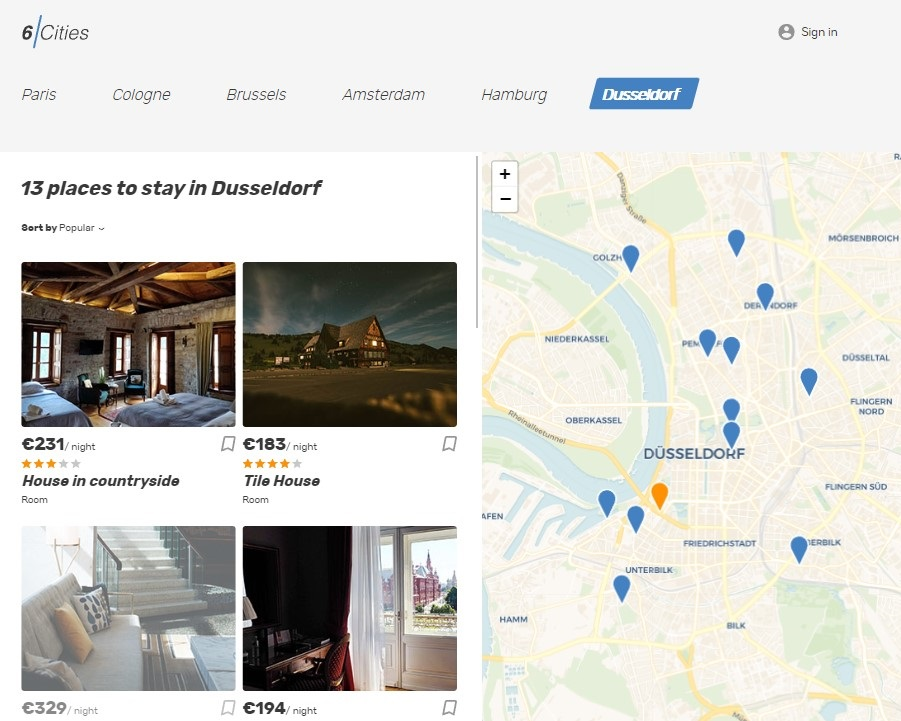
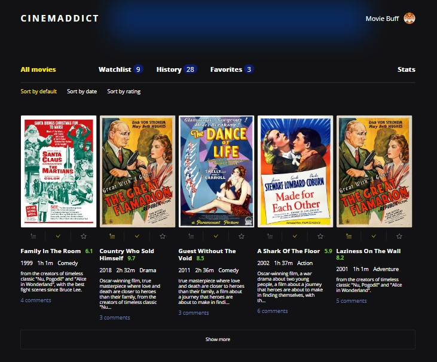
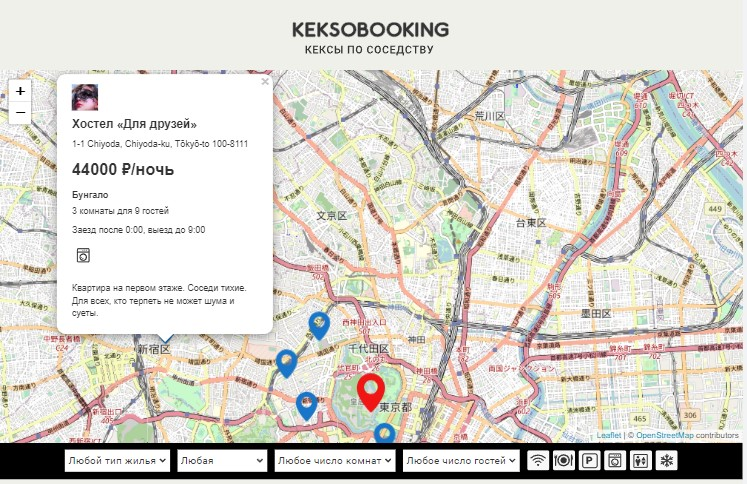
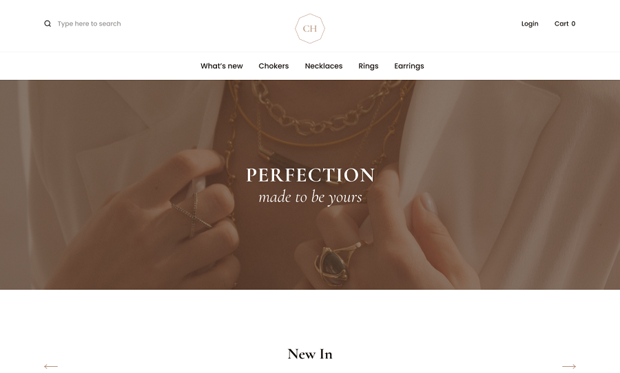
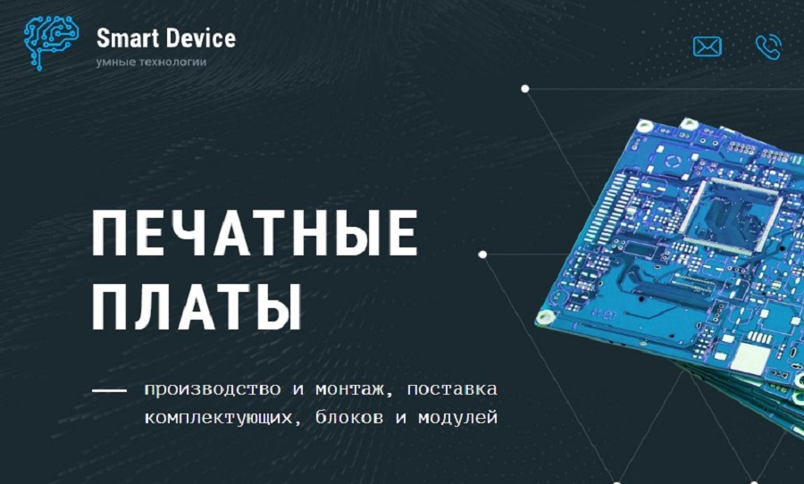
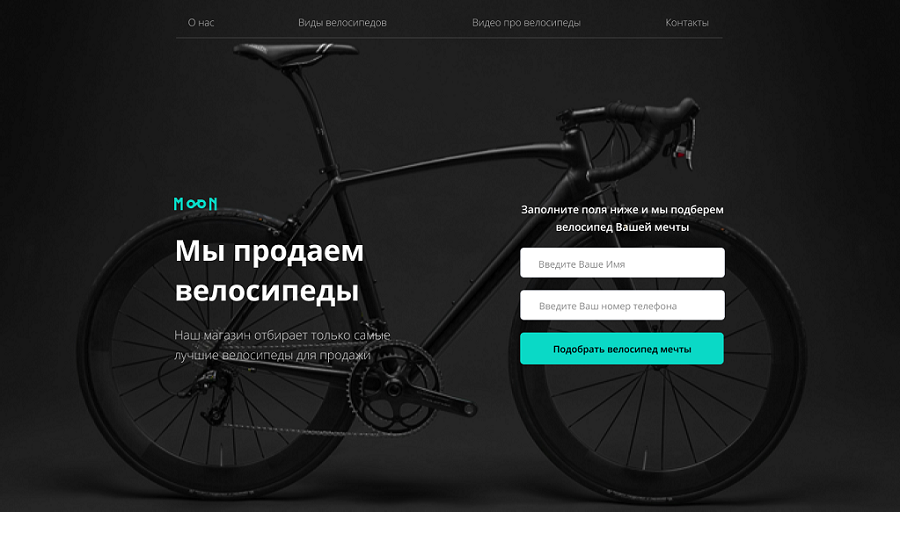
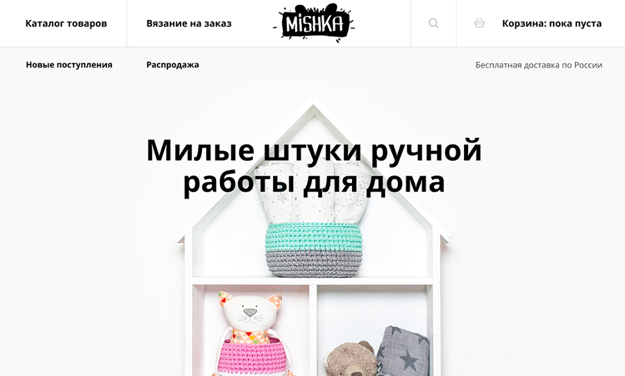

<h2>hey there </h2>

I'm a Junior Frontend Developer

### 🛠 Languages and Tools

      
    

### 💻 Portfolio

<table>

  <tr>
    <td>
      
    </td>
    <td max-width='750'>
      <h3><a href='https://github.com/KateMoro/Six-Cities'>Six Cities</a></h3>
      
Typescript, React (FC, Hooks, Router), Redux Toolkit, Axios

      
single-page application

    </td>
  </tr>

  <tr>
    <td>
       
    </td>
    <td>
      <h3><a href='https://github.com/KateMoro/Cinemaddict'>Cinemaddict</a></h3>
      
Javascript (ES6+), OOP, MVP, REST API, Webpack

      
single-page application

    </td>
  </tr>

  <tr>
    <td>
       
    </td>
    <td>
      <h3><a href='https://github.com/KateMoro/Keksobooking'>Keksobooking</a></h3>
      
Javascript (ES6+), Fetch API

      
single-page application

    </td>
  </tr>

  <tr>
    <td>
       
    </td>
    <td>
      <h3><a href='https://github.com/KateMoro/Jewellery'>Jewellery</a></h3>
      
HTML, SCSS, JavaScript, Gulp

      
multi-page application

    </td>
  </tr>

  <tr>
    <td>
       
    </td>
    <td>
      <h3><a href='https://github.com/KateMoro/Smart-Device'>Smart Device</a></h3>
      
HTML, SCSS, JavaScript, Gulp

      
multi-page application

    </td>
  </tr>

  <tr>
    <td>
       
    </td>
    <td>
      <h3><a href='https://github.com/KateMoro/bicycles'>Bicycles</a></h3>
      
HTML, SCSS, JavaScript, Gulp

      
multi-page application

    </td>
  </tr>

  <tr>
    <td>
       
    </td>
    <td>
      <h3><a href='https://github.com/KateMoro/Mishka'>Mishka</a></h3>
      
HTML, SCSS, JavaScript, Gulp

      
multi-page application

    </td>
  </tr>
</table>
